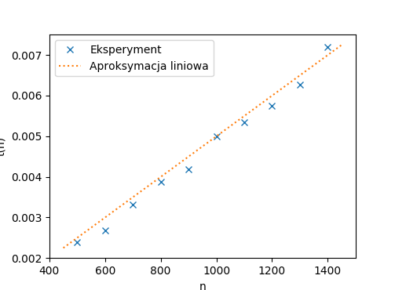

.. HashtableAnalysis documentation master file, created by
   sphinx-quickstart on Sun Nov 10 19:48:15 2019.
   You can adapt this file completely to your liking, but it should at least
   contain the root `toctree` directive.

Tablica Mieszająca dokumentacja
===============================

******
Autor:
******
Michał Kowieski, 293130

**************
Treść zadania:
**************
Przedmiotem analizy jest tablica mieszająca: tablica przechowuje rekordy zawierające napisy. Długość
tablicy jest ograniczona arbitralnie przez pewną stałą K. Dla danego napisu s obliczamy k=M(s) i
umieszczamy strukturę reprezentującą napis w tablicy mieszającej: H[k]. W przypadku kolizji funkcji
mieszającej (H[k] zajęte) reprezentujące napis s struktury danych zapisywane są w sposób
alternatywny zobacz warianty). Przedmiotem implementacji powinno być: dodanie i usunięcie
elementów w H[]. Wybór funkcji mieszającej M(s) do decyzji projektanta - ale patrz wariant 3

**W13:**
tablica H[k,n] (gdzie n=0...N) jest dwuwymiarowe, elementy kolidujące zapisywane są w lokalizacjach H[k,0], H[k,1], itd. (Oczywiście, przekroczenie przez drugi indeks rozmiaru tablicy będzie powodować odrzucenie elementu)

**W21:**
Testy przeprowadzić dla: listy słów języka polskiego wygenerowanych z zadanych tekstów. Generator należy wykonać samodzielnie.

**W31:**
Zastosować jedną funkcję mieszającą; dodatkowo przeprowadzić analizę dla enumeracji tablicy (wydobycia wszystkich elementów).

*******************
Działanie programu:
*******************

Na wejście program dostaje ciąg napisów. Najpierw dodaje je wszystkie do tablicy. Następnie generuje wewnętrzny stan tablicy mieszającej (jakie napisy się tam znajdują oraz w których są "kubełkach"). Ten stan zwraca użytkownikowi.

**************************
Opis implementacji:
**************************

###################
Oczyszczacz tekstu:
###################
**Algorytm:**

1. Podziel tekst na pojedyncze słowa
2. Dla każdego słowa
    1. Usuń znaki które nie są literami z początku słowa
    2. Usuń znaki które nie są literami z końca słowa
3. Zwróć słowa składające się tylko ze znaków

###############
Generator słów:
###############
Na podstawie danej listy słów generator zwraca z jednakowym rozkładem
każde ze słów.

###################
Funkcja mieszająca:
###################
Zastosowana została tak zwana "wielomianowa mieszająca funkcja krocząca" (ang. polynomial rolling hash function).
::

  hash(s) = s[0] + s[1] * p + s[2] * p^2 + ... + s[n-1] * p^(n-1) mod m

- s - napis dla którego chcemy wyliczyć wartość skrótu
- n - długość napisu s
- m - duża stała
- p - duża stała

###################
Tablica mieszająca:
###################
Tablica mieszająca przechowuje napisy i ich hash'e w tablicy dwuwymiarowej.
Elementy kolidujące zapisywane są w lokalizacjach H[k,0], H[k,1], itd.
Przekroczenie przez drugi indeks rozmiaru tablicy odrzuca element.

**************************
Analiza złożoności:
**************************

###################
Funkcja mieszająca:
###################
Wyliczanie wartości funkcji mieszającej polega na iteracji po wszystkich literach słowa.
Pojedynczy krok wymaga stałą ilość operacji.

Obliczenia: 1 * n = n

Złożoność: O(n)

- n - długość słowa

###################
Tablica mieszająca:
###################

Założenia:

- Napisy mają z góry określoną maksymalną długość
- Wartość współczynnika załadowania (ilość elementów tablicy / ilość wierszy tablicy) jest mniejsza od 1

**Dodawanie jednego elementu:**

Żeby dodwać dany element najpierw musi wyznaczyć wartość funkcji skrótu dla tego słowa. Jako że napisy
posiadają ograniczenie na długość to złożoność liczenia wartości funkcji mieszającej wynosi O(1).
Z wyliczonej wartości określamy wiersz w którym ma znaleźć się nasz napis. Ta operacja ma złożoność 0(1).
Teraz musimy znaleźć pierwszą wolną komórkę tablicy. Jako że współczynnik załadowania jest mnieszy od 1 to
średni numer pierwszej wolnej komórki jest mniejszy od 1, a z tego wynika że koszt tej operacji wynosi średnio O(1).

Obliczenia: 1 * 1 * 1 = 1

Średnia złożoność: O(1)

Istnieje też możliwość że wszystkie napisy zostały dodane do tego samego wiersza. Wtedy znalezienie pierwszej wolnej
komórki może wymagać n (ilość elementów w tablicy) operacji. Takie zdarzenie jest wielce nieprawdopodobne.

Pesymistyczna złożoność: O(n)

**Usuwanie jednego elementu:**

Żeby usunąć dany element najpierw musi wyznaczyć wartość funkcji skrótu dla tego słowa. Jako że napisy
posiadają ograniczenie na długość to złożoność liczenia wartości funkcji mieszającej wynosi O(1).
Z wyliczonej wartości określamy wiersz w którym ma znaleźć się nasz napis. Ta operacja ma złożoność 0(1).
Teraz musimy znaleźć pierwszą komórkę tablicy w której znajude się dany napis. Złożoność sprawdzenia czy
napisy są równe wynosi O(1) (z powodu oganiczonej długości). Jako że wartość współczynnika załadowania
jest mniejsza od 1 to średnia wartość wiersza szukanangeo napisu też jest mniejsza od 1.

Obliczenia: 1 * 1 * 1 * 1 = 1

Średnia złożoność: O(1)

Istnieje też możliwość że wszystkie napisy zostały dodane do tego samego wiersza. Wtedy znalezienie komórki w której 
znajduje się usuwany napis może wymagać n (ilość elementów w tablicy) operacji. Takie zdarzenie jest wielce nieprawdopodobne.

Pesymistyczna złożoność: O(n)

**Dodanie X elementów:**

Jako że średnia złożoność dodania jednego elementu wynosi O(1) to średnia złożoność dodanie x elementów to O(x).

Obliczenia: 1 * x = x

Średnia złożoność: O(x)

Istnieje też możliwość że wszystkie napisy zostaną dodane do tego samego wiersza. Takie zdarzenie jest wielce nieprawdopodobne.

Obliczenia: 1 + 2 + 3 + ... + (x - 1) + x = (x + 1) * x / 2

Pesymistyczna złożoność: O(x**2)

**Enumeracja tablicy:**

W celu pełnej enumeracji przechodzimy po kolei po wszystkich komórkach tablicy. Wierszy jest 'w', a kolumn 'k'. Przejście do
następnej komórki wymaga stałej ilości operacji.

Obliczenia: w * k * 1 = w * k

Złożoność: O(w*k)

*******************************
Eksperyment pomiarowy:
*******************************
**Algorytm:** 

Dodanie n słów do tablicy mieszającej.

**Teoretyczna złożoność algorytmu:**

O(n)

**Komenda:**

.. code-block:: bash

  python -m hashtableanalysis.hashtable 1000 100 benchmark pan-tadeusz.txt - 500 100 10 100

**Wynik:**

=  ====  ========  ========
i    n      t(n)      q(n)
=  ====  ========  ========
0   500  0.002382  0.953383
1   600  0.002671  0.891126
2   700  0.003317  0.948440
3   800  0.003878  0.970282
4   900  0.004182  0.930067
5  1000  0.004996  1.000000
6  1100  0.005341  0.971885
7  1200  0.005745  0.958225
8  1300  0.006273  0.965810
9  1400  0.007205  1.030163
=  ====  ========  ========

**Wnioski:**

Czasy wykonywania algorytmu jest zgodny z teoretyczną złożonością algorytmu. 
Niewielkie odchylenia wartości q(n) są spowodowanie przez m.in sposób implementacji interpretera CPythona.

***************************************
Opis zachowania w warunkach brzegowych:
***************************************
* Jeżeli dodanie napisu nie jest możliwe ponieważ tablica w wymiarze N jest pełna rzucany jest odpowiedni wyjątek.
* Jeżeli istnieje już dany napis w tablicy rzucany jest odpowiedni wyjątek.
* Jeżeli usunięcie napisu nie jest możliwe ponieważ danego napisu nie ma rzucany jest odpowiedni wyjątek.

************************
Korzystanie z  programu:
************************

###############
Program główny:
###############

.. code-block:: bash

  hashtable [OPTIONS] ROWS COLUMNS COMMAND [ARGS]

Tworzy tablicę mieszającą posiadającą ROWS wierszy oraz
COLUMNS column.

**Args:**

- rows (int): Ilość wierszy tablicy mieszającej.
- columns (int): Ilość kolumn tablicy mieszającej.

Komendy:
--------

IO:
"""
.. code-block:: bash

  hashtable [OPTIONS] ROWS COLUMNS io [OPTIONS] INPUT OUTPUT

Pobiera słowa z INPUT. Potem dodaje je wszystkie do tablicy mieszającej.
Następnie na OUTPUT zostaje wygenerowany wewnętrzny stan tablicy
mieszającej.

**Args:**

- input (file): Plik na podstawie którego będą generowane dane.
- output (file): Plik do którego zostanie przekazany wynik.

GENERATE:
"""""""""
.. code-block:: bash

  hashtable [OPTIONS] ROWS COLUMNS generate [OPTIONS] INPUT OUTPUT NUMBER_OF_WORDS

Generuje NUMBER_OF_WORDS słow na podstawie INPUT. Potem dodaje je
wszystkie do tablicy mieszającej. Następnie na OUTPUT zostaje
wygenerowany wewnętrzny stan tablicy mieszającej.

**Args:**

- input (file): Plik na podstawie którego będą generowane dane.
- output (file): Plik do którego zostanie przekazany wynik.
- number_of_words (int): Liczba generowanych słów.

BENCHMARK:
""""""""""
.. code-block:: bash

  hashtable [OPTIONS] ROWS COLUMNS benchmark [OPTIONS] INPUT OUTPUT INITIAL_NUMBER_OF_WORDS STEP NUMBER_OF_PROBLEMS NUMBER_OF_INSTANCES

Wykonuje funkcję generate z pomiarem czasu dla rosnącej wartości
NUMBER_OF_WORDS. Przeprowadza porównanie ze słożonością teoretyczną.

**Args:**

- input (file): Plik na podstawie którego będą generowane dane.
- output (file): Plik do którego zostanie przekazany wynik.
- initial_number_of_words (int): Początkowa wartość NUMBER_OF_WORDS.
- step (int): Krok o ile będzie zwiększana wartość NUMBER_OF_WORDS.
- number_of_problems (int): Ilość rozwiązywanych problemów.
- number_of_insances (int): Ilość instancji problemu.

##################
Generator napisów:
##################
.. code-block:: bash

  wordgenerator [OPTIONS] INPUT OUTPUT NUMBER_OF_WORDS

**Args:**

- input (file): Plik na podstawie którego będą generowane dane.
- output (file): Plik do którego zostanie przekazany wynik.
- number_of_words (int): Ilość generowanych słów.

############################
Program oczyszczający tekst:
############################
.. code-block:: bash

  cleartext [OPTIONS] INPUT OUTPUT

**Args:**

- input (file): Plik na podstawie którego będą generowane dane.
- output (file): Plik do którego zostanie przekazany wynik.

****************
Moduły źródłowe:
****************
**hashtableanalysis/**

Pakiet główny. Zawiera 3 inne pakiety:

**cleartext/**

Pakiet odpowiedzialny za oczyszczanie tekstów.

**wordgenerator/**

Pakiet odpowiedzialny za generowanie słów.

**hashtable/**

Pakiet odpowiedzialny za tablicę mieszającej, funkcję mieszającą oraz główny program CLI.

***************************
Wykorzystywane technologie:
***************************
* Język - python3
* Biblioteki - pandas, click, sphinx, pytest

******************
Sposób instalacji:
******************
Wymagania:

- python3
- pip

Instalacja:

#. pip install --user poetry
#. poetry install
 

*************************
Przykłady uruchomienia:
*************************
.. code-block:: bash

  python -m hashtableanalysis.hashtable 1000 100 benchmark pan-tadeusz.txt - 500 100 10 100
.. code-block:: bash

  python -m hashtableanalysis.cleartext 200 10 - -
.. code-block:: bash

  python -m hashtableanalysis.wordgenerator 300 50 pan-tadeusz.txt - 100 